# Principais protocolos de comunicação da Internet  | HTTP | Web socket

## Protocolo de comunicação web HTTP

## cOMO FUNCIONA O PROTOCOLO http

Http : Hypertext Transfer Protocol (Http)

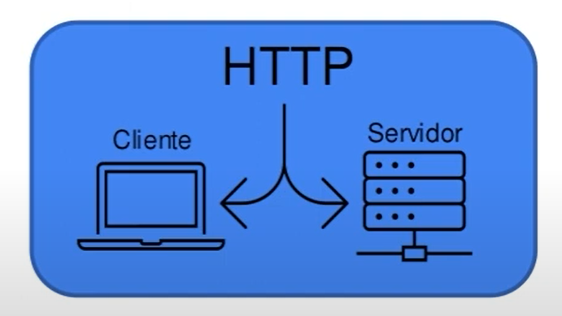
- Browser: implementa o client HTTP
- Servidor:vai hospedar os objetos web que o cliente solicita

- Cliente: Mensagens: Request HTTP(Objetos web)
- Servidor: Mensagens - Response HTTP(Protocolo TCP)

Uma arquitetura Cliente servidor , define dois lados o Cliente que se preocupa com os requests, e o server que se preocupa
com os responses, ou seja o que ele vai enviar para o cliente, ele não guarda estado só responde requisições, ele é 
stateless ou seja não guarda estado do cliente. 

O objetivo do XML e json é a serialização(Serialization) de dados, que é o processo de transformação dos dados para que haja comunicação
entre as partes, fazendo o processo de armazenar, transferir e recuperar as informações.

Dentro do XML especificamente nós temos os metadados.

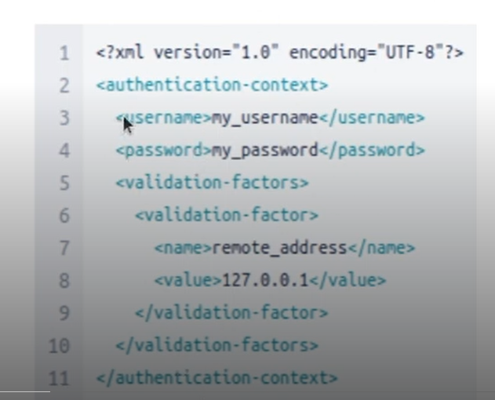

O que tem dentro dessa tag é o dado.

Json é baseado na sintaxe do JS ele é ligthweigt(sintaxe mais legível), independente de linguagem, estrutura chave valor.

XML e JSON COMUM:
- Auto descritivos
- Hierarquicos 
- independente de linguagem de programação
- Vasta utilização

Diferenças de xml e json

- o xml usa tags e o json estrutura chave valor.
- o json é mais legível e permite a utilização de Arrays
- o json hoje é mais utilizado hoje que o xml.

Por qual optar json ou xml? depende do uso, em sistemas legados o mais utilizado é o xml, precisa analizar  os
prós e contras do projeto

## Particularidades do HTTP VERSÃO 1.1

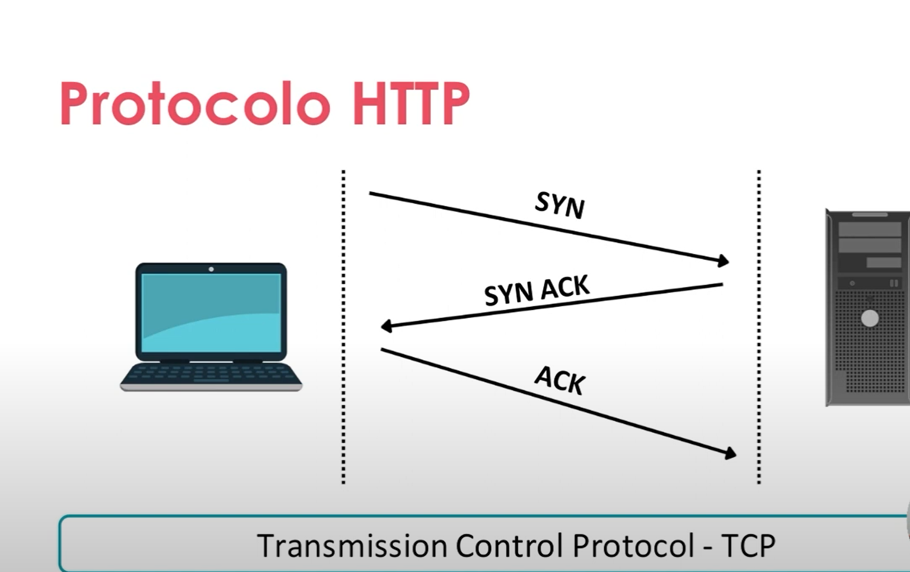

TCP é um protocolo da camada de transporte. Ela faz a comunicação de tres vias , handshake. 

Persistente : mantem a comunicação ativa;
Não persistente: encerrar assim que ele receber o que estou pedindo

o http ele envia um request e espera um response, e ele aguarda .

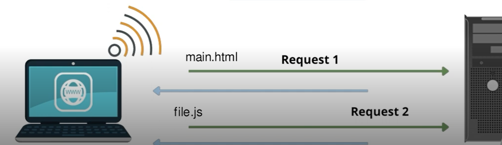

Os browsers permitem que os clientes façam até 6 requisições http simultaneas, Nesse caso eu não preciso
esperar que o response chegue até mim para que eu poder iniciar um nova requisição. Há não ser que a pagina que eu
esteja soliitando tenha mais objetos.

Head of line blocking(HOL)-> É quando eu faço a minha requisição e fico no agurado da respota

Repetição de dados(over head)-> estou inundando a rede com requisições http, enviando pacoes maiores do que eu precisaria.

TCP: CAMADA DE TRANSPORTE
HTTP: CAMADA DE APLICAÇÃO

A Lógica do modelo de camadas o http trabalha acima do TCP;

## Mensagens HTTP - Request e Response

o http possui mensagens HTTP. 
- Tipos requesr e response

Tanto o envio quanto o recebimento fazem o processo-> armazenamento->transmissão ->reconstrução.

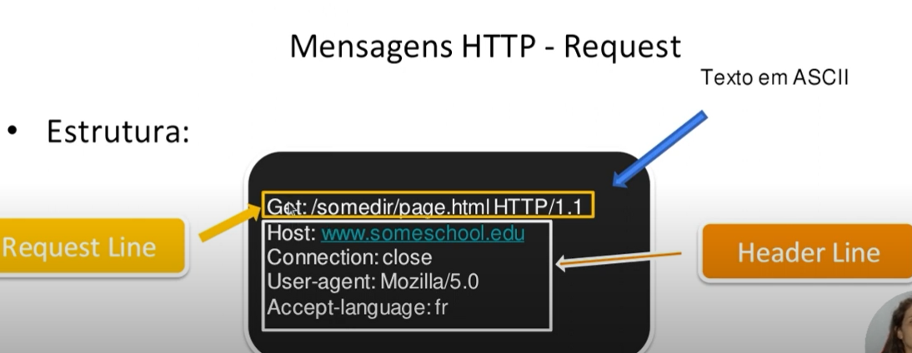

CONNECTION: CLOSE( close tipo de conexão uma conexão não persistente, ou seja uma vez que eu recebo as informações ela é encerrada,
uma vez que o servidor envia uma response ele encerra a conexão)
User agent: é  o agente que está fazendo a requisição , nesse caso o browser mozila, mas poderia fazer via postman, ou aplicação java
Accep-language: preferencia da linguagem, poderia ser pt...

90% das requisições da internet é feito por GET, ou seja estamos consumindo algum recurso da interne

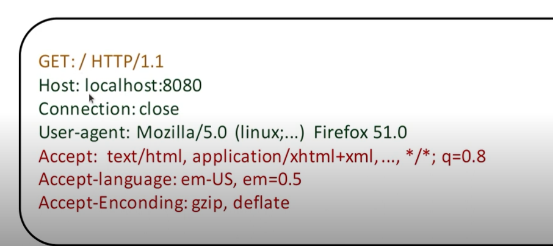
Host nesse caso é o local
Accept: é o tipo de informação que ue aceito receber

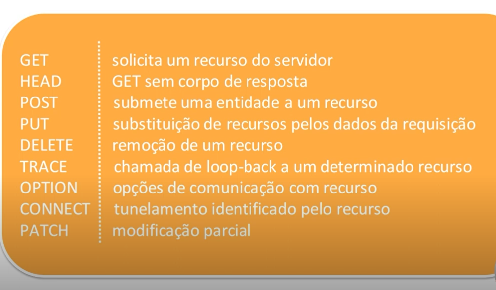

Métodos seguros, são aqueles que não mudam o estado do servidor

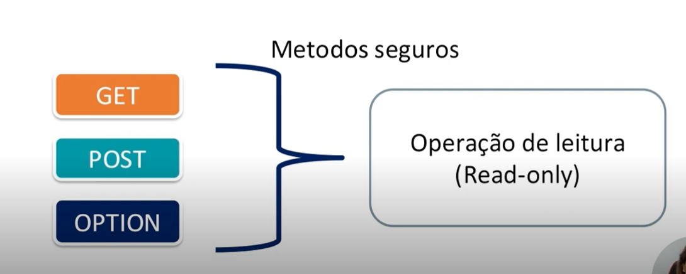

Todo método seguro é idempotente

Nem todo metodo idempotente é seguro.

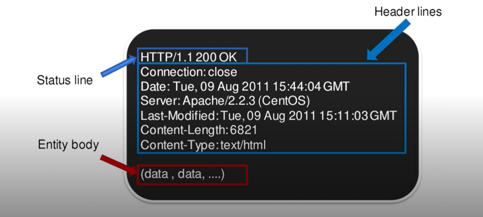

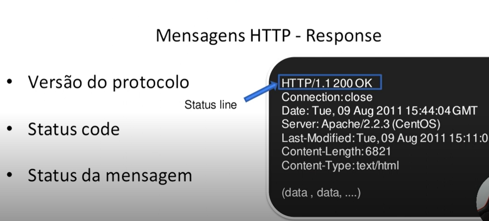

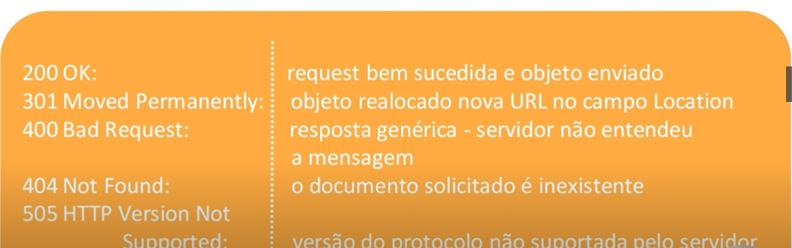

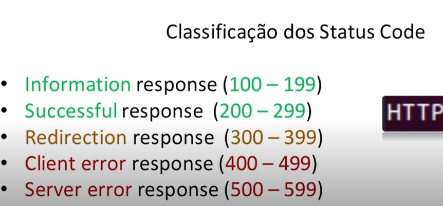

web distribuid Authoring and Versioning -webdav
WebDAV é um acrônimo de Web-based Distributed Authoring and Versioning, 
ou Criação e Distribuição de Conteúdo pela Web. É uma extensão do protocolo HTTP para transferência de arquivos; 
suporta bloqueio de recursos

## Para que serve Cookie e cache?

O http é stateless e ele é client/servidor. 

O que são cookies?
Pequenos pedaços de blocos de dados criados e utilizados pelo o servidor para persistir dados no dispositivo do cliente.
Os cookies estão dentro do hraderfile.

Caching?
cache ou memória cache é uma espécie de biblioteca que existe dentro de computadores e dispositivos móveis. 
Ele funciona para guardar dados, informações e processos temporários acessados com frequência.

Proxy server->
Um servidor proxy fica à frente do cliente ou de uma rede de clientes e faz a intermediação do tráfego.

Especificação: RFC 6265

## HTTP2.0 - Atualizações de prodotocolo

O http 2.0 trouxe de melhorias:
HOL- (Fiz uma requisição e bloqueie o estado do cliente até receber uma resposta do server) 

- Existe uma priorização de recursos, você configura os recursos mais importantes.

Formato geral de uma requisição HTTP

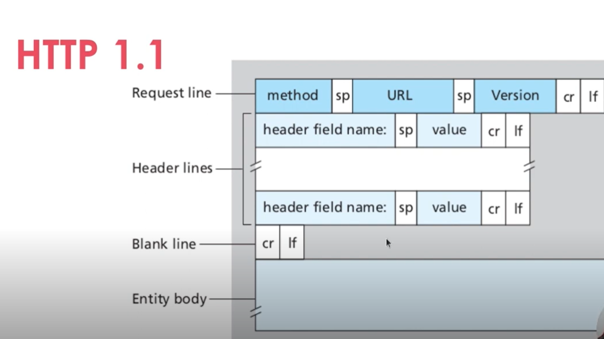

Header : cabeçalho
payload: corpo

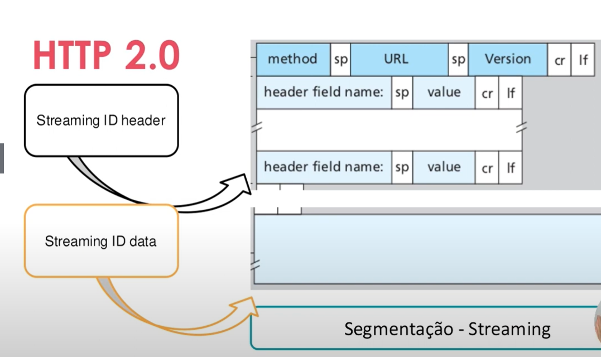

No 2.0 eu posso segmentar e compactar as requisições
Reutilização do Header.
Feature chamada push.
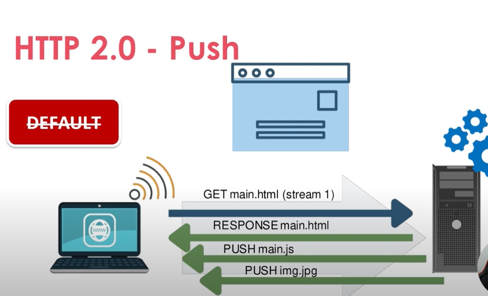
ou seja o cliente faz um request e o servidor  responde com tudo que le precisa.
Push não e habilitado pelo o default, no servidor que ser habilitado. E no cliente também tem que ser habilita.

- Unica conexão persistente
- Compressão e header
- Server push
- HTTPS por padrão TLS, ou seja é obrigatório o uso da camada de transporte
- Negosição no handshake

O cliente Suporta HTTP2.0
No momento que eu estou estabelecendo a conexão com o servidor através do handshake ele pergunta se ele tem ou não suporte
com http2;

Push do Servidor HTTP/2
Esta capacidade permite que o servidor envie ao cliente informações adicionais em cache que não são solicitadas, mas que são antecipadas em pedidos futuros

Contras:O cliente poupa recursos empurrados para o cache.
O cliente pode reutilizar estes recursos em cache através de diferentes páginas.
O servidor pode multiplexar recursos junto com as informações solicitadas originalmente dentro da mesma conexão TCP.
O servidor pode priorizar recursos empurrados – um diferencial de desempenho chave em HTTP/2 vs HTTP1.
O cliente pode recusar recursos empurrados para manter um repositório efetivo de recursos em cache ou desativar o Server Push por completo.
O cliente também pode limitar o número de fluxos empurrados multiplexados ao mesmo tempo.

- Se o push for configurado incorretamente não funcionará

Mixe 1.1 e 2.0
 - PODE GERAR LENTIDÃO 
 - LOAD BALANCER

## Servidores/Sistemas de aplicação

Os mais utilizados
- APACHE(NASCEU 1995 , contribuiu com o nascimento do www, open source. Modular, dinamico , altamente escalavel, tls/ssl, 
servidore virtuis com endereços, tanto para linux ou windows)
- XAMPP(apache server,maria db, interpretadores de script PHP/Perl, teste e desenvolvimento sem acesso a internet)
- NGINX(2004, web server, proxy reverso, load Balancer, http cache, suporte a http2.0)

35% apache e nginx 33%

Como acontece a comunicação cliente com o servidor.

## Conceitos básicos de segurança da informação

Criptografia por chave e Certificado digital

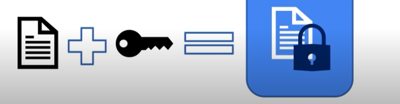

Podemos mapear o texto legivel para um texto ilegivel e eu só consigo abrir o arquivo utilizando a chave.

Chaves:

- Criptografia por chave Assimetrica
chave privada(assinatura -criptografia)
chave publica( verificação de autenticidade)

- Simetrica
conhecimento previo da chave
como tranferir achave
Ex: cifra de Cesar
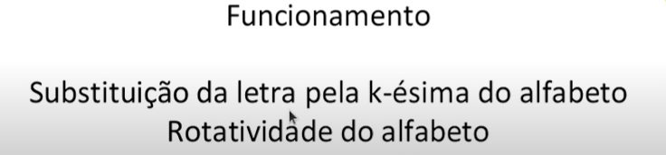
 Temos k=[1,26] 
k=3
 Bob , I love you. Alice
Ere, I oryh brx. Dolfh.

## Protocolo SSL - Secure Socket Layer

Secure Socket Layers - SSL 

SSL é protocolo de segurança de conexão , trabalha por cima do  TCP

Garante confidencialidade, Integridade e Autenticidade entre os end-point.

TLS é a terceira versão do SSL.

Qual a importancia do SSL? 

SSL é a sigla para Secure Sockets Layer, uma ferramenta de segurança digital usada para comunicar sites e navegadores de
forma criptografada. É ela a responsável por modificar os endereços dos sites de HTTP para HTTPS, o que indica que oferecem 
comunicação segura com o servidor

## Operação do SSL e considerações finais

Temos tres fases nas operações SSL

- Handshake
- key derivation
- Data transfer
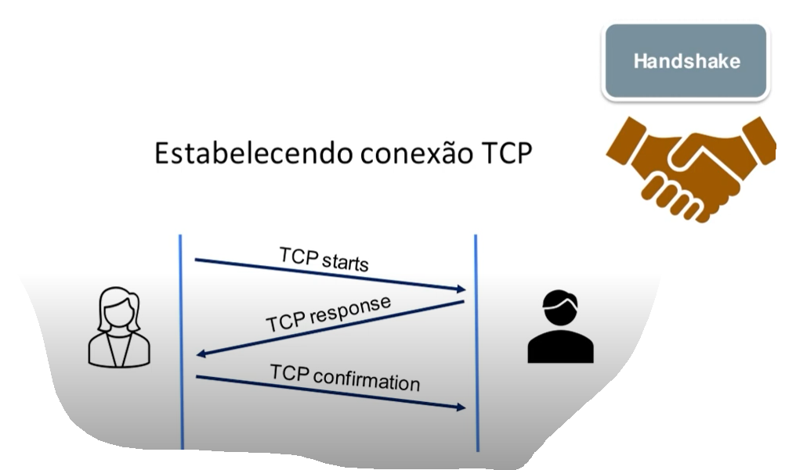
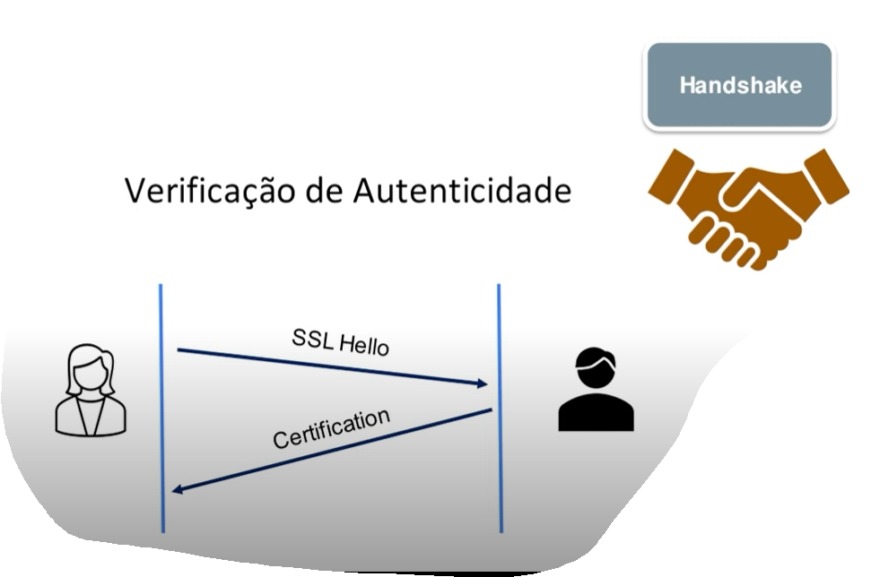
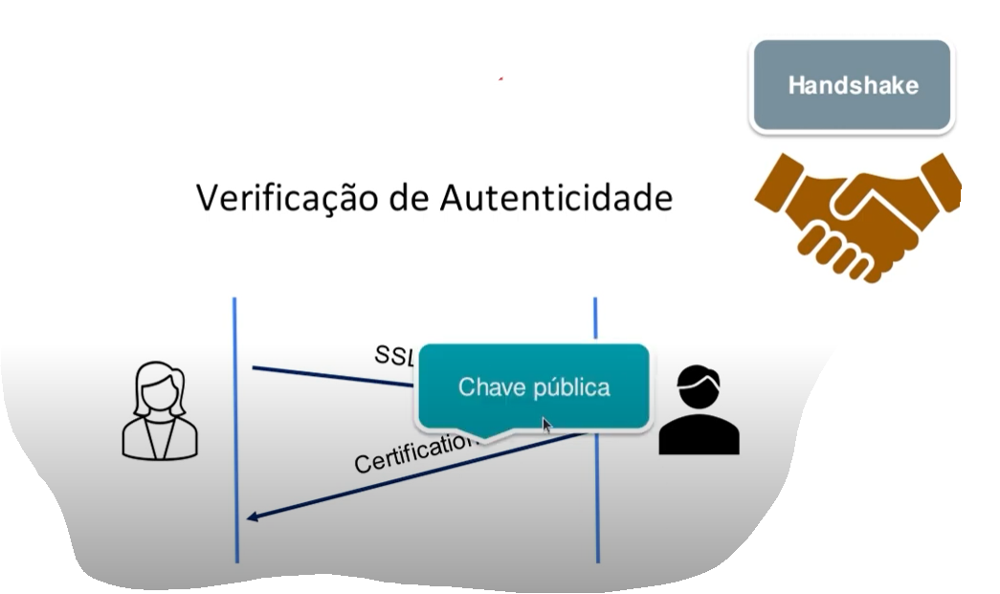
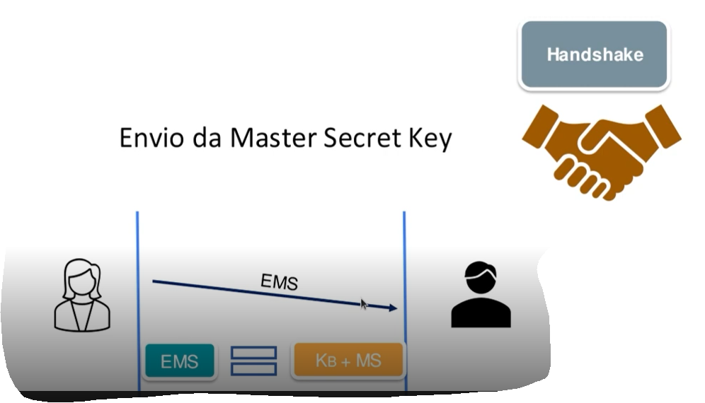
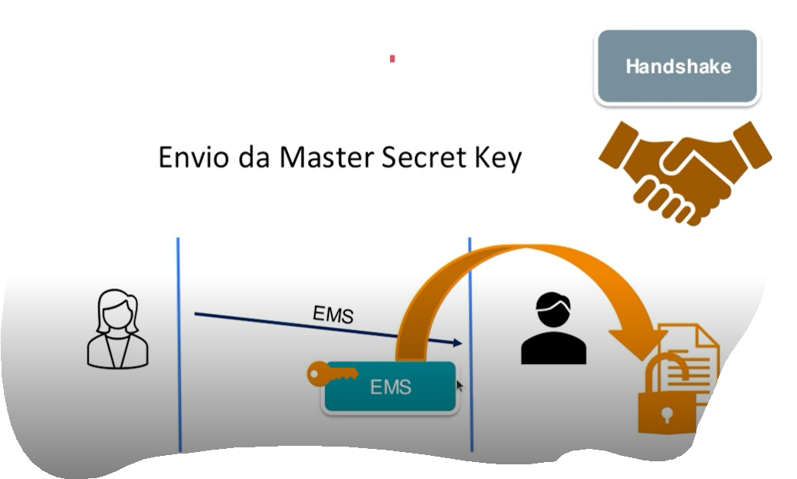

## WebSocket

WebSocket é uma tecnologia que permite a comunicação bidirecional por canais full-duplex sobre um único soquete Transmission Control Protocol. Ele é projetado para ser executado em browsers e servidores web que suportem o HTML5, mas pode ser usado por qualquer cliente ou servidor de aplicativos.

Como isso funciona? Quando o browser carrega a página Web um script do cliente envia uma solicitação de handshake de WebSocket para o servidor de aplicações. A aplicação pode aceitar mensagens binárias e de JSON dos clientes conectados na sessão e transmitir as mensagens para todos os clientes conectados.

WebSockets é uma tecnologia avançada que torna possível abrir uma sessão de comunicação interativa entre o navegador do usuário e um servidor. Com esta API, você pode enviar mensagens para um servidor e receber respostas orientadas a eventos sem ter que consultar o servidor para obter uma resposta.

WebSocket é um protocolo de comunicação entre aplicativos (navegadores), que por debaixo dos panos tem seus dados transportados pelo protocolo TCP, que por sua vez faz a ponte entre dois sockets (conceito do sistema operacional). Em outras palavras, o WebSocket usa sockets

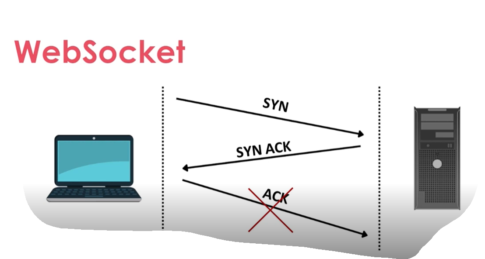
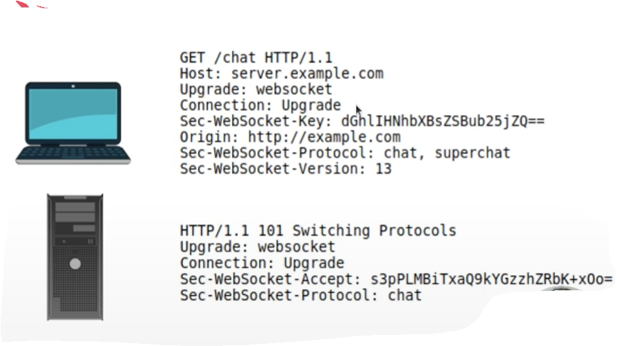

Obs:

Balanceamento de carga (Load balancing)
Todo o hardware tem o seu limite, e muitas vezes o mesmo serviço tem que ser repartido por várias máquinas, sob pena de se tornar congestionado. Estas soluções podem-se especializar em pequenos grupos sobre os quais se faz um balanceamento de carga: utilização do CPU, de armazenamento, ou de rede.

## Referencias

https://drive.google.com/file/d/1IeS6XI7uc3Xy3X7kA2rgjKHClwxeP3hR/view
- https://kinsta.com/pt/aprenda/http2/