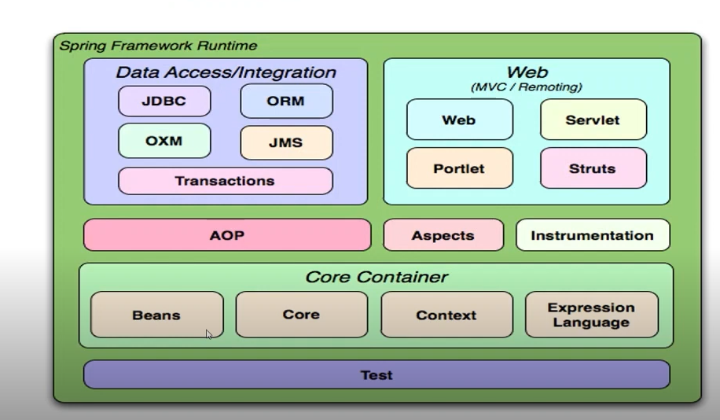
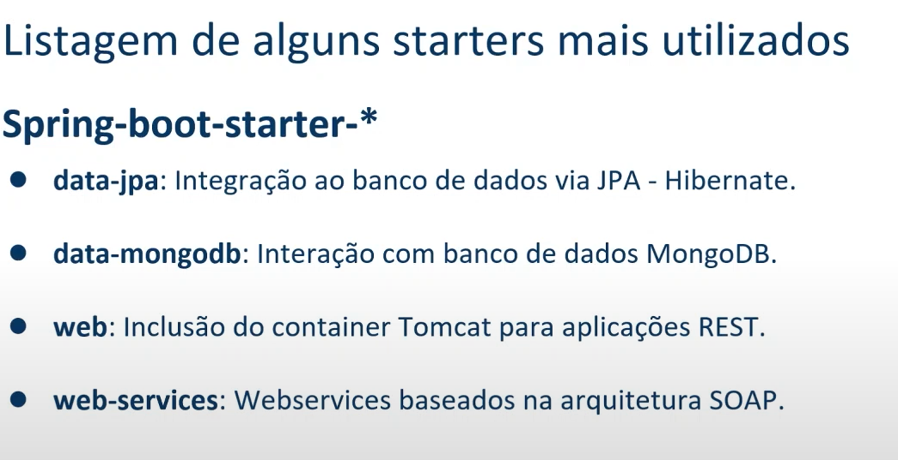

## Fundamentos Spring

- O que é o Spring Framework
Framework Open Source desenvolvido para a plataforma java. Quando falamos de Spring estamos falando em inversão de controle
atribuir resonsabilidade a um container

Sua estrutura é composta por modulos. Ou seja existe modulos espeficificos para cada finalidade. Ele é baseado no modulo core

Beans são os objetos gerenciados pelo o container Spring, com eles temos uma baixa dependencia/acoplamento.

Podemos ter interações com o Banco de dados, com o JDBC ou partindo para ORM atravpes de outros frameworks.

Temos o Padrão web, estruturas voltados a teste e outros...

- Spring X Java EE
Spring foi um movimento diante da alta burocracia e verbosidade, e inumeros processos que a Java EE exigia. 

- Conceito de Inversão de controle(Inversão of Control)
IOC trata-se de redirecionamento de fluxo de execução do código, retirando parcialmente o controle sobre ele e delegando-o para um container.
O principal proposito é minimizar o acoplamneto de código.

- Injeção de dependencias
Injeção de dependencia é um padrão de desenvolvimento com a finalidade de manyter baixo o nível de acoplamaneto entre módulos deum sistema.

- Beans/Autowired/Scopes
Beans objeto qie é instanciado(criado), montado e gerenciado por um container através do principio da inversão de controle

Scopes padrão

Singleton(um unico objeto sendo compartilhado por toda a aplicação) 
Propotype (criado uma nova instancia a cada solicitação do container)
HTTP Requesr - um bean será criado para cada requisição http
HTTP session: um bean será criado para aa sessão do usuario

Autowired: uma anotação onde deverá ocorrer um injeção automatica de dependencia.

Obs:
No contexto de classes, acoplamento refere-se ao modo como diferentes classes se conectam umas com as outras. 
Acoplamento fraco ou baixo acoplamento: os componentes de um sistema são interconectados de modo que um dependa 
do outro o mínimo possível

Enquanto o Spring Framework é baseado no padrão de injeção de dependencias. Ele é uma biblioteca

Springboot foca na configuração automatica. Ou seja o desenvolvedor foca no bussiness.

Startes: descritor de dependencias, ela encapsula todas as dependencias.

JPA é uma especificação e ORM é a ferramenta (Hibernate, Entity, etc
